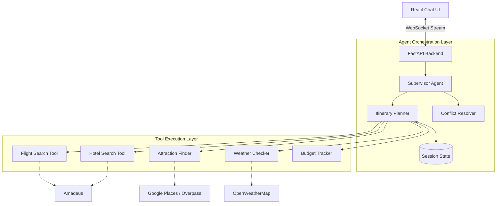

# Autonomous AI Travel Planning Agent

## Project Overview

This is a production-grade, end-to-end agentic AI system designed to transform natural language travel preferences into complete, optimized, day-by-day itineraries. The agent autonomously searches for flights, hotels, attractions, and restaurants; resolves scheduling conflicts; adapts plans based on weather forecasts; and presents the final itinerary through a polished, interactive chat interface.

The system is built on a multi-layer architecture, utilizing LangGraph for complex agent orchestration and a FastAPI backend with WebSocket streaming to a modern React frontend.

## Key Features

* **Multi-Tool Orchestration:** Leverages over 10 specialized tools to fetch real-world data, including flight availability, hotel pricing, local attractions, and 7-day weather forecasts.
* **Intelligent Optimization:** Features multi-constraint itinerary construction that balances budget, time windows, location proximity, and weather conditions.
* **Dynamic Conflict Resolution:** Automatically identifies and resolves overlapping activities, impossible travel times, and budget overruns.
* **Interactive Frontend:** A React-based chat UI with real-time WebSocket streaming, expandable day views, and embedded map visualizations.
* **Geospatial Awareness:** Groups nearby attractions and estimates travel times to build highly efficient daily routes.
* **Production-Ready:** Includes a comprehensive automated test suite (Pytest, Playwright), CI/CD workflows, and robust API error handling with graceful fallback mechanisms.

## Technology Stack

### Backend & AI Orchestration
* **Python 3.11+**
* **LangGraph & LangChain:** For agent state machine, tool execution, and memory management.
* **FastAPI:** Async REST API and WebSocket handling.
* **Pydantic:** Strict data validation and typed state management.

### Frontend
* **React 18 & Vite**
* **TypeScript & JavaScript**
* **Tailwind CSS:** Modern, responsive styling.
* **Leaflet.js:** Interactive map rendering for itinerary previews.

### APIs & Data Sources
* **Amadeus API:** Flight and hotel search data.
* **Google Places / Overpass API:** Attraction and restaurant discovery.
* **OpenWeatherMap API:** Weather-aware scheduling and forecasting.
* **SerpApi:** Supplemental web search for dynamic data enrichment.

## System Architecture



## How to Run It Locally on Your Laptop

### 1. Prerequisites
* Python 3.11 or higher
* Node.js v18 or higher
* Poetry (Python package manager)

### 2. Clone the Repository
```bash
git clone https://github.com/Nishra2611/ai-travel-agent.git
cd ai-travel-agent
```

### 3. Setup Environment Variables
Create a `.env` file in the root directory and add your API keys:
```env
OPENAI_API_KEY=your_openai_key
SERPAPI_API_KEY=your_serpapi_key
OPENWEATHERMAP_API_KEY=your_openweathermap_key
# Add other required API keys as specified in the configuration
```

### 4. Start the Backend Server
Open a terminal, install Python dependencies using Poetry, and start the FastAPI server:
```bash
poetry install
poetry run uvicorn src.ai_travel_agent.api.main:app --host 0.0.0.0 --port 8001 --reload
```
The backend will run on `http://localhost:8001`.

### 5. Start the Frontend Development Server
Open a new terminal window, navigate to the frontend directory, install Node dependencies, and start Vite:
```bash
cd frontend
npm install
npm run dev
```
The frontend will typically run on `http://localhost:5173`. Open this URL in your browser to interact with the AI Travel Agent.

### 6. Running the Test Suite
To execute the automated test suite (which includes unit and integration tests) without requiring a live server:
```bash
poetry run pytest tests/unit tests/integration -m "not live_server"
```
